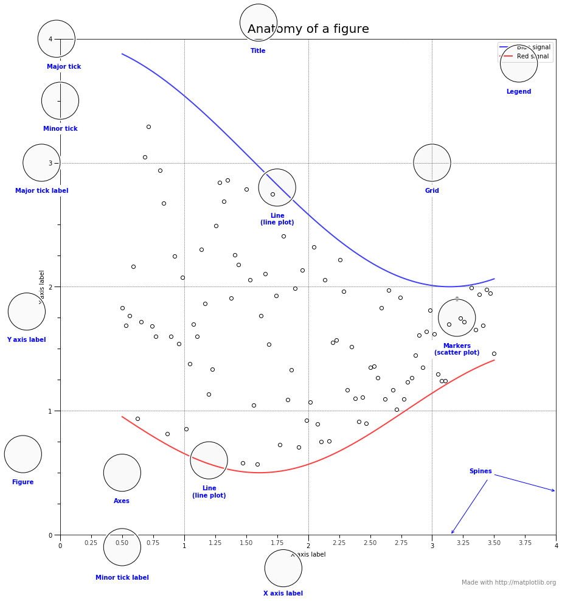
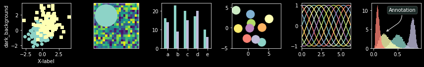
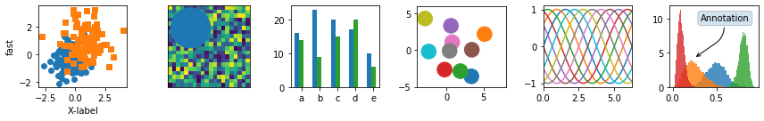
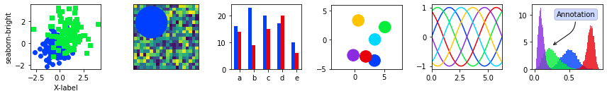
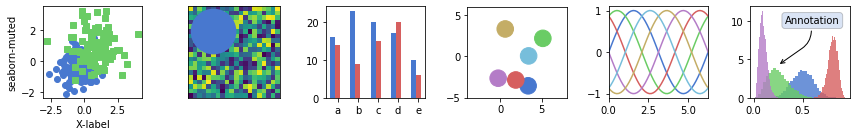
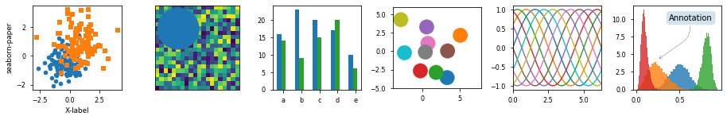
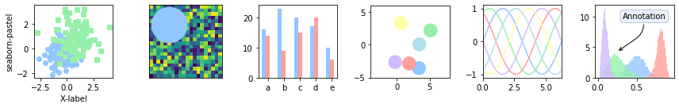
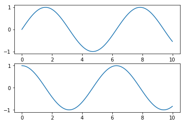
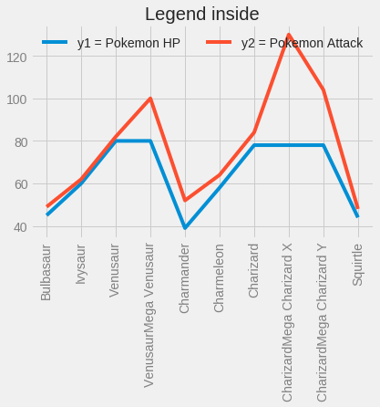

# **Matplotlib**

* Matplolib kütüphanesi: Matplotlib, platformlarda çeşitli basılı figürler ve etkileşimli ortamlarda kullanılabilen bir Python 2D çizim kütüphanesidir. Matplotlib, Python scriptlerinde, IPython dosyalarında, Jupyter notebook ve web uygulama sunucularında kullanılabilir.

* **Not: Burada bulunan anahtar kelimeler Türkçeleştirilmeden kullanılmıştır. internette arama yaparken daha kolay bulabilmeniz içindir.**


```python
import numpy as np
import pandas as pd

import warnings
warnings.filterwarnings('ignore')

df = pd.read_csv('../datas/Pokemon.csv')
```

## **Matplotlib Kütüphanesini Tanımlama**


```python
import matplotlib.pyplot as plt
```

## **Matplotlib Nesne Yapısı**

Matplotlib'den en iyi şekilde yararlanmak için, nesne yapısını çok iyi bilmeniz gerekir.


```python
from matplotlib.ticker import AutoMinorLocator, MultipleLocator, FuncFormatter

np.random.seed(19680801)

X = np.linspace(0.5, 3.5, 100)
Y1 = 3+np.cos(X)
Y2 = 1+np.cos(1+X/0.75)/2
Y3 = np.random.uniform(Y1, Y2, len(X))

fig = plt.figure(figsize=(15, 15))
ax = fig.add_subplot(1, 1, 1, aspect=1)


def minor_tick(x, pos):
    if not x % 1.0:
        return ""
    return "%.2f" % x

ax.xaxis.set_major_locator(MultipleLocator(1.000))
ax.xaxis.set_minor_locator(AutoMinorLocator(4))
ax.yaxis.set_major_locator(MultipleLocator(1.000))
ax.yaxis.set_minor_locator(AutoMinorLocator(4))
ax.xaxis.set_minor_formatter(FuncFormatter(minor_tick))

ax.set_xlim(0, 4)
ax.set_ylim(0, 4)

ax.tick_params(which='major', width=1.0)
ax.tick_params(which='major', length=10)
ax.tick_params(which='minor', width=1.0, labelsize=10)
ax.tick_params(which='minor', length=5, labelsize=10, labelcolor='0.25')

ax.grid(linestyle="--", linewidth=0.5, color='.25', zorder=-10)

ax.plot(X, Y1, c=(0.25, 0.25, 1.00), lw=2, label="Blue signal", zorder=10)
ax.plot(X, Y2, c=(1.00, 0.25, 0.25), lw=2, label="Red signal")
ax.plot(X, Y3, linewidth=0,
        marker='o', markerfacecolor='w', markeredgecolor='k')

ax.set_title("Anatomy of a figure", fontsize=20, verticalalignment='bottom')
ax.set_xlabel("X axis label")
ax.set_ylabel("Y axis label")

ax.legend()


def circle(x, y, radius=0.15):
    from matplotlib.patches import Circle
    from matplotlib.patheffects import withStroke
    circle = Circle((x, y), radius, clip_on=False, zorder=10, linewidth=1,
                    edgecolor='black', facecolor=(0, 0, 0, .0125),
                    path_effects=[withStroke(linewidth=5, foreground='w')])
    ax.add_artist(circle)


def text(x, y, text):
    ax.text(x, y, text, backgroundcolor="white",
            ha='center', va='top', weight='bold', color='blue')


# Minor tick
circle(0.50, -0.10)
text(0.50, -0.32, "Minor tick label")

# Major tick
circle(-0.03, 4.00)
text(0.03, 3.80, "Major tick")

# Minor tick
circle(0.00, 3.50)
text(0.00, 3.30, "Minor tick")

# Major tick label
circle(-0.15, 3.00)
text(-0.15, 2.80, "Major tick label")

# X Label
circle(1.80, -0.27)
text(1.80, -0.45, "X axis label")

# Y Label
circle(-0.27, 1.80)
text(-0.27, 1.6, "Y axis label")

# Title
circle(1.60, 4.13)
text(1.60, 3.93, "Title")

# Blue plot
circle(1.75, 2.80)
text(1.75, 2.60, "Line\n(line plot)")

# Red plot
circle(1.20, 0.60)
text(1.20, 0.40, "Line\n(line plot)")

# Scatter plot
circle(3.20, 1.75)
text(3.20, 1.55, "Markers\n(scatter plot)")

# Grid
circle(3.00, 3.00)
text(3.00, 2.80, "Grid")

# Legend
circle(3.70, 3.80)
text(3.70, 3.60, "Legend")

# Axes
circle(0.5, 0.5)
text(0.5, 0.3, "Axes")

# Figure
circle(-0.3, 0.65)
text(-0.3, 0.45, "Figure")

color = 'blue'
ax.annotate('Spines', xy=(4.0, 0.35), xycoords='data',
            xytext=(3.3, 0.5), textcoords='data',
            weight='bold', color=color,
            arrowprops=dict(arrowstyle='->',
                            connectionstyle="arc3",
                            color=color))

ax.annotate('', xy=(3.15, 0.0), xycoords='data',
            xytext=(3.45, 0.45), textcoords='data',
            weight='bold', color=color,
            arrowprops=dict(arrowstyle='->',
                            connectionstyle="arc3",
                            color=color))

ax.text(4.0, -0.4, "Made with http://matplotlib.org",
        fontsize=10, ha="right", color='.5')

plt.show()
```





## **Çıktıları Dosya Olarak Kaydetme**

Bazen ürettiğimiz figürü kaydetmek isteyebiliriz. Bunun için matplotlib'in dosya kaydederken hangi dosya türlerini desteklediğiniz bilmemiz gerekir.


```python
fig = plt.figure()
# fig.savefig('my_figure.png') -> This code save the your figure.
fig.canvas.get_supported_filetypes()
```


    {'ps': 'Postscript',
     'eps': 'Encapsulated Postscript',
     'pdf': 'Portable Document Format',
     'pgf': 'PGF code for LaTeX',
     'png': 'Portable Network Graphics',
     'raw': 'Raw RGBA bitmap',
     'rgba': 'Raw RGBA bitmap',
     'svg': 'Scalable Vector Graphics',
     'svgz': 'Scalable Vector Graphics',
     'jpg': 'Joint Photographic Experts Group',
     'jpeg': 'Joint Photographic Experts Group',
     'tif': 'Tagged Image File Format',
     'tiff': 'Tagged Image File Format'}


    <Figure size 432x288 with 0 Axes>


## **Stiller(Stylesheets)**

Matplotlib'de birçok stil var. Bu stillerin tümü aşağıda listelenmiştir.


```python
plt.style.available
# plt.style.use('stylename')
```


    ['seaborn-muted',
     'seaborn',
     'seaborn-talk',
     'seaborn-colorblind',
     'seaborn-poster',
     'seaborn-ticks',
     'seaborn-dark',
     'seaborn-whitegrid',
     'ggplot',
     'seaborn-pastel',
     'classic',
     'seaborn-white',
     'seaborn-bright',
     'Solarize_Light2',
     'seaborn-paper',
     'fivethirtyeight',
     'fast',
     'seaborn-dark-palette',
     'dark_background',
     'bmh',
     'seaborn-notebook',
     'seaborn-deep',
     '_classic_test',
     'grayscale',
     'seaborn-darkgrid',
     'tableau-colorblind10']


```python
def plot_scatter(ax, prng, nb_samples=100):
    """Scatter plot.
    """
    for mu, sigma, marker in [(-.5, 0.75, 'o'), (0.75, 1., 's')]:
        x, y = prng.normal(loc=mu, scale=sigma, size=(2, nb_samples))
        ax.plot(x, y, ls='none', marker=marker)
    ax.set_xlabel('X-label')
    return ax


def plot_colored_sinusoidal_lines(ax):
    """Plot sinusoidal lines with colors following the style color cycle.
    """
    L = 2 * np.pi
    x = np.linspace(0, L)
    nb_colors = len(plt.rcParams['axes.prop_cycle'])
    shift = np.linspace(0, L, nb_colors, endpoint=False)
    for s in shift:
        ax.plot(x, np.sin(x + s), '-')
    ax.set_xlim([x[0], x[-1]])
    return ax


def plot_bar_graphs(ax, prng, min_value=5, max_value=25, nb_samples=5):
    """Plot two bar graphs side by side, with letters as x-tick labels.
    """
    x = np.arange(nb_samples)
    ya, yb = prng.randint(min_value, max_value, size=(2, nb_samples))
    width = 0.25
    ax.bar(x, ya, width)
    ax.bar(x + width, yb, width, color='C2')
    ax.set_xticks(x + width)
    ax.set_xticklabels(['a', 'b', 'c', 'd', 'e'])
    return ax


def plot_colored_circles(ax, prng, nb_samples=15):
    """Plot circle patches.

    NB: draws a fixed amount of samples, rather than using the length of
    the color cycle, because different styles may have different numbers
    of colors.
    """
    for sty_dict, j in zip(plt.rcParams['axes.prop_cycle'], range(nb_samples)):
        ax.add_patch(plt.Circle(prng.normal(scale=3, size=2),
                                radius=1.0, color=sty_dict['color']))
    # Force the limits to be the same across the styles (because different
    # styles may have different numbers of available colors).
    ax.set_xlim([-4, 8])
    ax.set_ylim([-5, 6])
    ax.set_aspect('equal', adjustable='box')  # to plot circles as circles
    return ax


def plot_image_and_patch(ax, prng, size=(20, 20)):
    """Plot an image with random values and superimpose a circular patch.
    """
    values = prng.random_sample(size=size)
    ax.imshow(values, interpolation='none')
    c = plt.Circle((5, 5), radius=5, label='patch')
    ax.add_patch(c)
    # Remove ticks
    ax.set_xticks([])
    ax.set_yticks([])


def plot_histograms(ax, prng, nb_samples=10000):
    """Plot 4 histograms and a text annotation.
    """
    params = ((10, 10), (4, 12), (50, 12), (6, 55))
    for a, b in params:
        values = prng.beta(a, b, size=nb_samples)
        ax.hist(values, histtype="stepfilled", bins=30, alpha=0.8, normed=True)
    # Add a small annotation.
    ax.annotate('Annotation', xy=(0.25, 4.25), xycoords='data',
                xytext=(0.9, 0.9), textcoords='axes fraction',
                va="top", ha="right",
                bbox=dict(boxstyle="round", alpha=0.2),
                arrowprops=dict(
                          arrowstyle="->",
                          connectionstyle="angle,angleA=-95,angleB=35,rad=10"),
                )
    return ax


def plot_figure(style_label=""):
    """Setup and plot the demonstration figure with a given style.
    """
    # Use a dedicated RandomState instance to draw the same "random" values
    # across the different figures.
    prng = np.random.RandomState(96917002)

    # Tweak the figure size to be better suited for a row of numerous plots:
    # double the width and halve the height. NB: use relative changes because
    # some styles may have a figure size different from the default one.
    (fig_width, fig_height) = plt.rcParams['figure.figsize']
    fig_size = [fig_width * 2, fig_height / 2]

    fig, axes = plt.subplots(ncols=6, nrows=1, num=style_label,
                             figsize=fig_size, squeeze=True)
    axes[0].set_ylabel(style_label)

    plot_scatter(axes[0], prng)
    plot_image_and_patch(axes[1], prng)
    plot_bar_graphs(axes[2], prng)
    plot_colored_circles(axes[3], prng)
    plot_colored_sinusoidal_lines(axes[4])
    plot_histograms(axes[5], prng)

    fig.tight_layout()

    return fig


if __name__ == "__main__":

    # Setup a list of all available styles, in alphabetical order but
    # the `default` and `classic` ones, which will be forced resp. in
    # first and second position.
    style_list = list(plt.style.available)  # *new* list: avoids side effects.
    style_list.remove('classic')  # `classic` is in the list: first remove it.
    style_list.sort()
    style_list.insert(0, u'default')
    style_list.insert(1, u'classic')

    # Plot a demonstration figure for every available style sheet.
    for style_label in style_list:
        with plt.style.context(style_label):
            fig = plot_figure(style_label=style_label)

    plt.show()
```




















## **İki Arayüz**

MatPlotlib'i kullanmanın iki farklı yolu vardır. Bunlardan ilki MATLAB stili, ikincisi ise nesne yönelimli arayüz stilidir. Şimdi bunlara bakalım.

### **MATLAB Stil Arayüzü**


```python
plt.figure()  # create a plot figure
x = np.linspace(0, 10, 100)
# create the first of two panels and set current axis
plt.subplot(2, 1, 1) # (rows, columns, panel number)
plt.plot(x, np.sin(x))

# create the second panel and set current axis
plt.subplot(2, 1, 2)
plt.plot(x, np.cos(x));
plt.show()
```





### **Nesne Yönelimli Arayüz**


```python
# First create a grid of plots
# ax will be an array of two Axes objects
fig, ax = plt.subplots(2)

# Call plot() method on the appropriate object
ax[0].plot(x, np.sin(x))
ax[1].plot(x, np.cos(x));
```


## **Scatter Plots**
Scatter Plot gösterimi için farklı yöntemler ve özelleştirmeler vardır. Bunlara bakalım.

### **plot**


```python
x = np.linspace(0, 10, 30)
y = np.sin(x)

plt.plot(x, y, 'o', color='black');
plt.show()
```


```python
rng = np.random.RandomState(0)
for marker in ['o', '.', ',', 'x', '+', 'v', '^', '<', '>', 's', 'd']:
    plt.plot(rng.rand(5), rng.rand(5), marker,
             label="marker='{0}'".format(marker))
plt.legend(numpoints=1)
plt.xlim(0, 1.8);
plt.show()
```


```python
plt.plot(x, y, '-ok');
plt.show()
```


```python
plt.plot(x, y, '-p', color='gray',
         markersize=15, linewidth=4,
         markerfacecolor='white',
         markeredgecolor='gray',
         markeredgewidth=2)
plt.ylim(-1.2, 1.2);
```


### **scatter**

Plt.scatter öğesinin plt.plot öğesinden temel farkı, her bir noktanın özelliklerinin (boyut, yüz rengi, kenar rengi vb.) Ayrı ayrı kontrol edilebileceği veya verilere eşlenebileceği scatter plot oluşturmak için kullanılabilmesidir.


```python
plt.scatter(x, y, marker='o');
plt.show()
```


**Renkli scatter plot**


```python
rng = np.random.RandomState(0)
x = rng.randn(100)
y = rng.randn(100)
colors = rng.rand(100)
sizes = 1000 * rng.rand(100)

plt.scatter(x, y, c=colors, s=sizes, alpha=0.3,
            cmap='viridis')
plt.colorbar();  # show color scale
```


## **Basit Hata Çubukları**


```python
plt.style.use('seaborn-whitegrid')
x = np.linspace(0, 10, 50)
dy = 0.8
y = np.sin(x) + dy * np.random.randn(50)

plt.errorbar(x, y, yerr=dy, fmt='.k');
```


```python
plt.errorbar(x, y, yerr=dy, fmt='o', color='black',ecolor='lightgray', elinewidth=3, capsize=0);
```


## **Histograms, Binnings, ve Density**


```python
plt.style.use('seaborn-white')

data = np.random.randn(1000)
plt.hist(data);
```


```python
plt.hist(data, bins=30, normed=True, alpha=0.5,
         histtype='stepfilled', color='steelblue',
         edgecolor='none');
plt.show()
```


**Renkli histogram**


```python
x1 = np.random.normal(0, 0.8, 1000)
x2 = np.random.normal(-2, 1, 1000)
x3 = np.random.normal(3, 2, 1000)

kwargs = dict(histtype='stepfilled', alpha=0.3, normed=True, bins=40)

plt.hist(x1, **kwargs)
plt.hist(x2, **kwargs)
plt.hist(x3, **kwargs);
```


## **İki Boyutlu Histograms and Binnings**


```python
mean = [0, 0]
cov = [[1, 1], [1, 2]]
x, y = np.random.multivariate_normal(mean, cov, 10000).T
plt.hist2d(x, y, bins=30, cmap='Blues')
cb = plt.colorbar()
cb.set_label('counts in bin')
```


```python
plt.hexbin(x, y, gridsize=30, cmap='Blues')
cb = plt.colorbar(label='count in bin')
```


## **Plot Legend Nesnesini Özelleştirme**


```python
x = np.linspace(0, 10, 1000)
fig, ax = plt.subplots()
ax.plot(x, np.sin(x), '-b', label='Sine')
ax.plot(x, np.cos(x), '--r', label='Cosine')
ax.axis('equal')
leg = ax.legend();
```


```python
ax.legend(loc='upper left', frameon=False)
fig
```


```python
ax.legend(frameon=False, loc='lower center', ncol=2)
fig
```


```python
ax.legend(fancybox=True, framealpha=1, shadow=True, borderpad=1)
fig
```


## **Legend İçin Eleman Seçimi**


```python
y = np.sin(x[:, np.newaxis] + np.pi * np.arange(0, 2, 0.5))
lines = plt.plot(x, y)

# lines is a list of plt.Line2D instances
plt.legend(lines[:2], ['first', 'second']);
```


```python
plt.plot(x, y[:, 0], label='first')
plt.plot(x, y[:, 1], label='second')
plt.plot(x, y[:, 2:])
plt.legend(framealpha=1, frameon=True);
```


## **Birden Fazla Legend**


```python
fig, ax = plt.subplots()

lines = []
styles = ['-', '--', '-.', ':']
x = np.linspace(0, 10, 1000)

for i in range(4):
    lines += ax.plot(x, np.sin(x - i * np.pi / 2),
                     styles[i], color='black')
ax.axis('equal')

# specify the lines and labels of the first legend
ax.legend(lines[:2], ['line A', 'line B'],
          loc='upper right', frameon=False)

# Create the second legend and add the artist manually.
from matplotlib.legend import Legend
leg = Legend(ax, lines[2:], ['line C', 'line D'],
             loc='lower right', frameon=False)
ax.add_artist(leg);
```


## **Renk Çubuğunu Özelleştirme**


```python
x = np.linspace(0, 10, 1000)
I = np.sin(x) * np.cos(x[:, np.newaxis])

plt.imshow(I)
plt.colorbar();
```


```python
plt.imshow(I, cmap='gray');
```


```python
speckles = (np.random.random(I.shape) < 0.01)
I[speckles] = np.random.normal(0, 3, np.count_nonzero(speckles))

plt.figure(figsize=(10, 3.5))

plt.subplot(1, 2, 1)
plt.imshow(I, cmap='RdBu')
plt.colorbar()

plt.subplot(1, 2, 2)
plt.imshow(I, cmap='RdBu')
plt.colorbar(extend='both')
plt.clim(-1, 1);
```


```python
plt.imshow(I, cmap=plt.cm.get_cmap('Blues', 6))
plt.colorbar()
plt.clim(-1, 1);
```


## **Birden Fazla Subplot**


```python
ax1 = plt.axes()  # standard axes
ax2 = plt.axes([0.65, 0.65, 0.2, 0.2])
```


```python
fig = plt.figure()
ax1 = fig.add_axes([0.1, 0.5, 0.8, 0.4],
                   xticklabels=[], ylim=(-1.2, 1.2))
ax2 = fig.add_axes([0.1, 0.1, 0.8, 0.4],
                   ylim=(-1.2, 1.2))

x = np.linspace(0, 10)
ax1.plot(np.sin(x))
ax2.plot(np.cos(x));
```


## **Basit Subplot Izgaraları**


```python
for i in range(1, 7):
    plt.subplot(2, 3, i)
    plt.text(0.5, 0.5, str((2, 3, i)),
             fontsize=18, ha='center')
```


```python
fig = plt.figure()
fig.subplots_adjust(hspace=0.4, wspace=0.4)
for i in range(1, 7):
    ax = fig.add_subplot(2, 3, i)
    ax.text(0.5, 0.5, str((2, 3, i)),
           fontsize=18, ha='center')
```


```python
fig, ax = plt.subplots(2, 3, sharex='col', sharey='row')
```


```python
# axes are in a two-dimensional array, indexed by [row, col]
for i in range(2):
    for j in range(3):
        ax[i, j].text(0.5, 0.5, str((i, j)),
                      fontsize=18, ha='center')
fig
```


## **Daha Karmaşık Düzenlemeler**


```python
grid = plt.GridSpec(2, 3, wspace=0.4, hspace=0.3)
plt.subplot(grid[0, 0])
plt.subplot(grid[0, 1:])
plt.subplot(grid[1, :2])
plt.subplot(grid[1, 2]);
```


```python
# Create some normally distributed data
mean = [0, 0]
cov = [[1, 1], [1, 2]]
x, y = np.random.multivariate_normal(mean, cov, 3000).T

# Set up the axes with gridspec
fig = plt.figure(figsize=(6, 6))
grid = plt.GridSpec(4, 4, hspace=0.2, wspace=0.2)
main_ax = fig.add_subplot(grid[:-1, 1:])
y_hist = fig.add_subplot(grid[:-1, 0], xticklabels=[], sharey=main_ax)
x_hist = fig.add_subplot(grid[-1, 1:], yticklabels=[], sharex=main_ax)

# scatter points on the main axes
main_ax.plot(x, y, 'ok', markersize=3, alpha=0.2)

# histogram on the attached axes
x_hist.hist(x, 40, histtype='stepfilled',
            orientation='vertical', color='gray')
x_hist.invert_yaxis()

y_hist.hist(y, 40, histtype='stepfilled',
            orientation='horizontal', color='gray')
y_hist.invert_xaxis()
```


## **Text ve Annotation**

* ax.transData: Veri koordinatlarıyla ilişkili dönüşüm
* ax.transAxes: Eksenlerle ilişkili dönüşüm (eksen ölçü birimleri cinsinden)
* fig.transFigure: Şekille ilişkili dönüşüm (şekil boyutlarının birimlerinde)


```python
fig, ax = plt.subplots(facecolor='lightgray')
ax.axis([0, 10, 0, 10])

# transform=ax.transData is the default, but we'll specify it anyway
ax.text(1, 5, ". Data: (1, 5)", transform=ax.transData)
ax.text(0.5, 0.1, ". Axes: (0.5, 0.1)", transform=ax.transAxes)
ax.text(0.2, 0.2, ". Figure: (0.2, 0.2)", transform=fig.transFigure);
```


```python
ax.set_xlim(0, 2)
ax.set_ylim(-6, 6)
fig
```


## **Arrows ve Annotation**


```python
fig, ax = plt.subplots()

x = np.linspace(0, 20, 1000)
ax.plot(x, np.cos(x))
ax.axis('equal')

ax.annotate('local maximum', xy=(6.28, 1), xytext=(10, 4),
            arrowprops=dict(facecolor='black', shrink=0.05))

ax.annotate('local minimum', xy=(5 * np.pi, -1), xytext=(2, -6),
            arrowprops=dict(arrowstyle="->",
                            connectionstyle="angle3,angleA=0,angleB=-90"));
```


## **Ticks Özelleştirme**


```python
ax = plt.axes(xscale='log', yscale='log')
ax.grid();
```


## **Matplotlib'i Özelleştirme: Konfigürasyonlar ve Stiller**


```python
x = np.random.randn(1000)
plt.hist(x);
```


```python
from matplotlib import cycler
colors = cycler('color',
                ['#EE6666', '#3388BB', '#9988DD',
                 '#EECC55', '#88BB44', '#FFBBBB'])
plt.rc('axes', facecolor='#E6E6E6', edgecolor='none',
       axisbelow=True, grid=True, prop_cycle=colors)
plt.rc('grid', color='w', linestyle='solid')
plt.rc('xtick', direction='out', color='gray')
plt.rc('ytick', direction='out', color='gray')
plt.rc('patch', edgecolor='#E6E6E6')
plt.rc('lines', linewidth=2)
plt.hist(x);
```


## **Matplotlib'de Üç Boyutlu Görsel Çizme**


```python
from mpl_toolkits import mplot3d
fig = plt.figure()
ax = plt.axes(projection='3d')
```


```python
ax = plt.axes(projection='3d')

# Data for a three-dimensional line
zline = np.linspace(0, 15, 1000)
xline = np.sin(zline)
yline = np.cos(zline)
ax.plot3D(xline, yline, zline, 'gray')

# Data for three-dimensional scattered points
zdata = 15 * np.random.random(100)
xdata = np.sin(zdata) + 0.1 * np.random.randn(100)
ydata = np.cos(zdata) + 0.1 * np.random.randn(100)
ax.scatter3D(xdata, ydata, zdata, c=zdata, cmap='Greens');
```


## **Matplotlib Nesneleri**

### **Line-styles References**


```python
color = 'cornflowerblue'
points = np.ones(5)  # Draw 5 points for each line
text_style = dict(horizontalalignment='right', verticalalignment='center',
                  fontsize=12, fontdict={'family': 'monospace'})


def format_axes(ax):
    ax.margins(0.2)
    ax.set_axis_off()


# Plot all line styles.
fig, ax = plt.subplots()

linestyles = ['-', '--', '-.', ':']
for y, linestyle in enumerate(linestyles):
    ax.text(-0.1, y, repr(linestyle), **text_style)
    ax.plot(y * points, linestyle=linestyle, color=color, linewidth=3)
    format_axes(ax)
    ax.set_title('Line-styles Reference')

plt.show()
```


### **Line styles**


```python
from collections import OrderedDict
from matplotlib.transforms import blended_transform_factory

linestyles = OrderedDict(
    [('solid',               (0, ())),
     ('loosely dotted',      (0, (1, 10))),
     ('dotted',              (0, (1, 5))),
     ('densely dotted',      (0, (1, 1))),

     ('loosely dashed',      (0, (5, 10))),
     ('dashed',              (0, (5, 5))),
     ('densely dashed',      (0, (5, 1))),

     ('loosely dashdotted',  (0, (3, 10, 1, 10))),
     ('dashdotted',          (0, (3, 5, 1, 5))),
     ('densely dashdotted',  (0, (3, 1, 1, 1))),

     ('loosely dashdotdotted', (0, (3, 10, 1, 10, 1, 10))),
     ('dashdotdotted',         (0, (3, 5, 1, 5, 1, 5))),
     ('densely dashdotdotted', (0, (3, 1, 1, 1, 1, 1)))])


plt.figure(figsize=(10, 6))
ax = plt.subplot(1, 1, 1)

X, Y = np.linspace(0, 100, 10), np.zeros(10)
for i, (name, linestyle) in enumerate(linestyles.items()):
    ax.plot(X, Y+i, linestyle=linestyle, linewidth=1.5, color='black')

ax.set_ylim(-0.5, len(linestyles)-0.5)
plt.yticks(np.arange(len(linestyles)), linestyles.keys())
plt.xticks([])

# For each line style, add a text annotation with a small offset from
# the reference point (0 in Axes coords, y tick value in Data coords).
reference_transform = blended_transform_factory(ax.transAxes, ax.transData)
for i, (name, linestyle) in enumerate(linestyles.items()):
    ax.annotate(str(linestyle), xy=(0.0, i), xycoords=reference_transform,
                xytext=(-6, -12), textcoords='offset points', color="blue",
                fontsize=8, ha="right", family="monospace")
ax.set_title('Line styles')
plt.tight_layout()
plt.show()
```


### **Fill style**


```python
from matplotlib.lines import Line2D


points = np.ones(5)  # Draw 3 points for each line
text_style = dict(horizontalalignment='right', verticalalignment='center',
                  fontsize=12, fontdict={'family': 'monospace'})
marker_style = dict(color='cornflowerblue', linestyle=':', marker='o',
                    markersize=15, markerfacecoloralt='gray')


def format_axes(ax):
    ax.margins(0.2)
    ax.set_axis_off()


fig, ax = plt.subplots()

# Plot all fill styles.
for y, fill_style in enumerate(Line2D.fillStyles):
    ax.text(-0.5, y, repr(fill_style), **text_style)
    ax.plot(y * points, fillstyle=fill_style, **marker_style)
    format_axes(ax)
    ax.set_title('fill style')

plt.show()
```


### **Un-filled markers**


```python
points = np.ones(3)  # Draw 3 points for each line
text_style = dict(horizontalalignment='right', verticalalignment='center',
                  fontsize=12, fontdict={'family': 'monospace'})
marker_style = dict(linestyle=':', color='0.8', markersize=10,
                    mfc="C0", mec="C0")


def format_axes(ax):
    ax.margins(0.2)
    ax.set_axis_off()
    ax.invert_yaxis()


def nice_repr(text):
    return repr(text).lstrip('u')


def math_repr(text):
    tx = repr(text).lstrip('u').strip("'").strip("$")
    return r"'\${}\$'".format(tx)


def split_list(a_list):
    i_half = len(a_list) // 2
    return (a_list[:i_half], a_list[i_half:])
```


```python
fig, axes = plt.subplots(ncols=2)
fig.suptitle('un-filled markers', fontsize=14)

# Filter out filled markers and marker settings that do nothing.
unfilled_markers = [m for m, func in Line2D.markers.items()
                    if func != 'nothing' and m not in Line2D.filled_markers]

for ax, markers in zip(axes, split_list(unfilled_markers)):
    for y, marker in enumerate(markers):
        ax.text(-0.5, y, nice_repr(marker), **text_style)
        ax.plot(y * points, marker=marker, **marker_style)
        format_axes(ax)

plt.show()
```


### **Filled markers**


```python
fig, axes = plt.subplots(ncols=2)
for ax, markers in zip(axes, split_list(Line2D.filled_markers)):
    for y, marker in enumerate(markers):
        ax.text(-0.5, y, nice_repr(marker), **text_style)
        ax.plot(y * points, marker=marker, **marker_style)
        format_axes(ax)
fig.suptitle('filled markers', fontsize=14)

plt.show()
```


### **Special Marker**


```python
fig, ax = plt.subplots()
fig.subplots_adjust(left=0.4)

marker_style.update(mec="None", markersize=15)
markers = ["$1$", r"$\frac{1}{2}$", "$f$", "$\u266B$",
           r"$\mathcircled{m}$"]

for y, marker in enumerate(markers):
    ax.text(-0.5, y, math_repr(marker), **text_style)
    ax.plot(y * points, marker=marker, **marker_style)
format_axes(ax)

plt.show()
```


### **Renkler**


```python
import matplotlib.colors as mcolors


def plot_colortable(colors, title, sort_colors=True, emptycols=0):

    cell_width = 212
    cell_height = 22
    swatch_width = 48
    margin = 12
    topmargin = 40

    # Sort colors by hue, saturation, value and name.
    by_hsv = ((tuple(mcolors.rgb_to_hsv(mcolors.to_rgba(color)[:3])), name)
                    for name, color in colors.items())
    if sort_colors is True:
        by_hsv = sorted(by_hsv)
    names = [name for hsv, name in by_hsv]

    n = len(names)
    ncols = 4 - emptycols
    nrows = n // ncols + int(n % ncols > 0)

    width = cell_width * 4 + 2 * margin
    height = cell_height * nrows + margin + topmargin
    dpi = 72

    fig, ax = plt.subplots(figsize=(width / dpi, height / dpi), dpi=dpi)
    fig.subplots_adjust(margin/width, margin/height,
                        (width-margin)/width, (height-topmargin)/height)
    ax.set_xlim(0, cell_width * 4)
    ax.set_ylim(cell_height * (nrows-0.5), -cell_height/2.)
    ax.yaxis.set_visible(False)
    ax.xaxis.set_visible(False)
    ax.set_axis_off()
    ax.set_title(title, fontsize=24, loc="left", pad=10)

    for i, name in enumerate(names):
        row = i % nrows
        col = i // nrows
        y = row * cell_height

        swatch_start_x = cell_width * col
        swatch_end_x = cell_width * col + swatch_width
        text_pos_x = cell_width * col + swatch_width + 7

        ax.text(text_pos_x, y, name, fontsize=14,
                horizontalalignment='left',
                verticalalignment='center')

        ax.hlines(y, swatch_start_x, swatch_end_x,
                  color=colors[name], linewidth=18)

    return fig

plot_colortable(mcolors.BASE_COLORS, "Base Colors",
                sort_colors=False, emptycols=1)
plot_colortable(mcolors.TABLEAU_COLORS, "Tableau Palette",
                sort_colors=False, emptycols=2)

#sphinx_gallery_thumbnail_number = 3
plot_colortable(mcolors.CSS4_COLORS, "CSS Colors")

# Optionally plot the XKCD colors (Caution: will produce large figure)
#xkcd_fig = plot_colortable(mcolors.XKCD_COLORS, "XKCD Colors")
#xkcd_fig.savefig("XKCD_Colors.png")

plt.show()
```


## Pokemon Veri Seti için Matplotlib

### **Bar Chart**


```python
# Bar Chart
type1Names = df['Type 1'].value_counts().index
type1Values = df['Type 1'].value_counts().values

plt.figure(figsize=(10,10))
plt.ylabel('Values', fontsize='medium')
plt.xlabel('Type 1', fontsize='medium')
plt.title('Top 20 Pokemon Type 1')
plt.bar(type1Names[:10],type1Values[:10], width = 0.7, color="blue",linewidth=0.4)
plt.show()
```


### **Horizontal Bar Chart**


```python
fig, ax = plt.subplots(figsize=(10,10))
plt.ylabel('Type 1', fontsize='medium')
plt.xlabel('Values', fontsize='medium')
plt.title('Top 20 Pokemon Type 1')
plt.style.use('fivethirtyeight')
ax.barh(type1Names[:5], type1Values[:5],color="blue")
plt.show()
```


### **Stacked Bar Chart**


```python
# Stacked Bar Chart
pokemon = df['Name'][:5]
hp = df['HP'][:5]
attack = df['Attack'][:5]
defense = df['Defense'][:5]
ind = [x for x, _ in enumerate(pokemon)]

plt.figure(figsize=(10,10))
plt.bar(ind, defense, width=0.8, label='Defense', color='blue', bottom=attack+hp)
plt.bar(ind, attack, width=0.8, label='Attack', color='gold', bottom=hp)
plt.bar(ind, hp, width=0.8, label='Hp', color='red')

plt.xticks(ind, pokemon)
plt.ylabel("Value")
plt.xlabel("Pokemon")
plt.legend(loc="upper right")
plt.title("5 Pokemon Defense & Attack & Hp")

plt.show()
```


### **Group Bar Chart**


```python
N = 5
pokemon_hp = df['HP'][:5]
pokemon_attack = df['Attack'][:5]

ind = np.arange(N) 
width = 0.35       
plt.bar(ind, pokemon_hp, width, label='HP')
plt.bar(ind + width, pokemon_attack, width,label='Attack')

plt.ylabel('Values')
plt.title('Pokemon Hp & Attack')

plt.xticks(ind + width / 2, (df['Name'][:5]),rotation=45)
plt.legend(loc='best')
plt.show()
```


### **Pie Chart**


```python
# Pie Chart
plt.figure(1, figsize=(8,8))
df['Type 1'].value_counts().head(5).plot.pie(autopct="%1.1f%%")
plt.legend()
plt.show()
```


### **Pie Chart - 2**


```python
# Pie chart

fig1, ax1 = plt.subplots()
ax1.pie(type1Values[:5], labels=type1Names[:5], autopct='%1.1f%%',shadow=True, startangle=90)
ax1.axis('equal')  # Equal aspect ratio ensures that pie is drawn as a circle.
plt.legend()
plt.show()
```


### **Pie Chart with Label**


```python
colors = ['yellowgreen', 'gold', 'lightskyblue', 'lightcoral','brown']
patches, texts = plt.pie(type1Values[:5], colors=colors, shadow=True, startangle=90)
plt.legend(patches, type1Names[:5], loc="best")
plt.axis('equal')
plt.tight_layout()
plt.show()
```


### **Nested Pie Chart**


```python
# nested pie chart
fig, ax = plt.subplots()

size = 0.3
vals = np.array([[60., 32.], [37., 40.], [29., 10.]])

cmap = plt.get_cmap("tab20c")
outer_colors = cmap(np.arange(3)*4)
inner_colors = cmap(np.array([1, 2, 5, 6, 9, 10]))

ax.pie(vals.sum(axis=1), radius=1, colors=outer_colors,
       wedgeprops=dict(width=size, edgecolor='w'))

ax.pie(vals.flatten(), radius=1-size, colors=inner_colors,
       wedgeprops=dict(width=size, edgecolor='w'))

ax.set(aspect="equal", title='Pie plot with `ax.pie`')
plt.show()
```


## Legend Example

### **Legend Underside**


```python
y1 = df['HP'][:10]
y2 = df['Attack'][:10]
x = df['Name'][:10]
fig = plt.figure()
ax = plt.subplot(111)
ax.plot(x, y1, label='y1 = Pokemon Hp')
ax.plot(x, y2, label='y2 = Pokemon Attack')
plt.title('Legend Underside')
plt.xticks(rotation=90)
ax.legend(loc='upper center', bbox_to_anchor=(0.5, -0.05),  shadow=True, ncol=2)
plt.show()
```


### **Legend Inside**


```python
y1 = df['HP'][:10]
y2 = df['Attack'][:10]
x = df['Name'][:10]
fig = plt.figure()
ax = plt.subplot(111)
ax.plot(x, y1, label='Pokemon HP')
ax.plot(x, y2, label='Pokemon Attack')
plt.title('Legend inside')
plt.xticks(rotation=90)
ax.legend()
plt.show()
```


### **Legend Inside - 2**


```python
y1 = df['HP'][:10]
y2 = df['Attack'][:10]
x = df['Name'][:10]
fig = plt.figure()
ax = plt.subplot(111)
ax.plot(x, y1, label='y1 = Pokemon HP')
ax.plot(x, y2, label='y2 = Pokemon Attack')
plt.title('Legend inside')
plt.xticks(rotation=90)
ax.legend(loc='upper center', bbox_to_anchor=(0.5, 1.00), shadow=True, ncol=2)
plt.show()
```





### **Legend Outside**


```python
y1 = df['HP'][:10]
y2 = df['Attack'][:10]
x = df['Name'][:10]
fig = plt.figure()
ax = plt.subplot(111)
ax.plot(x, y1, label='y1 = Pokemon HP')
ax.plot(x, y2, label='y2 = Pokemon Attack')
plt.title('Legend outside')
chartBox = ax.get_position()
plt.xticks(rotation=90)
ax.set_position([chartBox.x0, chartBox.y0, chartBox.width*0.6, chartBox.height])
ax.legend(loc='upper center', bbox_to_anchor=(1.45, 0.8), shadow=True, ncol=1)
plt.show()
```


### **Scatter Plot**


```python
# Create data
x = df['HP'][:35]
y = df['Attack'][:35]
colors = (0,0,0)
area = np.pi*9
 
# Plot
plt.scatter(x, y, s=area, c=colors, alpha=0.5)
plt.title('Scatter plot')
plt.xlabel('HP')
plt.ylabel('Attack')
plt.show()
```


### **Histogram**


```python
#Histogram
x = df['Attack'][:35]
num_bins = 5
n, bins, patches = plt.hist(x, num_bins, facecolor='blue', alpha=0.5)
plt.title('Histogram')
plt.xlabel('Attack')
plt.ylabel('Value')
plt.show()
```


### **Stackplot**


```python
# Stackplot
x = df['Name'][:4]
y1 = df['HP'][:4]
y2 = df['Attack'][:4]
y3 = df['Defense'][:4]

labels = ["HP ", "Attack", "Defense"]

fig, ax = plt.subplots()
ax.stackplot(x, y1, y2, y3)
ax.legend(loc='upper left', labels=labels)
plt.xticks(rotation=90)
plt.show()
```


### **2 Subplot**


```python
# Basic Subplot
# Data for plotting
x1 = df['Name'][:4]
x2 = df['Name'][:4]
y1 = df['HP'][:4]
y2 = df['Attack'][:4]

# Create two subplots sharing y axis
fig, (ax1, ax2) = plt.subplots(2, sharey=True)

ax1.plot(x1, y1, 'ko-')
ax1.set(title='2 subplots', ylabel='HP')

ax2.plot(x2, y2, 'r.-')
ax2.set(xlabel='Pokemon', ylabel='Attack')

plt.show()
```


### **3 Subplot**


```python
# Basic Subplot
# Data for plotting
x1 = df['Name'][:4]
x2 = df['Name'][:4]
x3 = df['Name'][:4]
y1 = df['HP'][:4]
y2 = df['Attack'][:4]
y3 = df['Defense'][:4]

# Create two subplots sharing y axis
fig, (ax1, ax2,ax3) = plt.subplots(3, sharey=True)

ax1.plot(x1, y1, 'ko-')
ax1.set(title='3 subplots', ylabel='HP')

ax2.plot(x2, y2, 'r.-')
ax2.set(xlabel='Pokemon', ylabel='Attack')

ax3.plot(x3, y3, ':')
ax3.set(xlabel='Pokemon', ylabel='Defense')

plt.show()
```


### **Color plot bar**


```python
ax = df['Type 1'].value_counts().sort_index().plot.bar(figsize = (12,6),fontsize = 14)
ax.set_title("Pokemon Type 1 Count", fontsize = 20)
ax.set_xlabel("Pokemon Type 1", fontsize = 20)
ax.set_ylabel("Value", fontsize = 20)

plt.show()
```


### **Linear Graph**


```python
plt.plot(df['HP'][:15], '-r')
plt.plot(df['Attack'][:15], ':g')
plt.legend()

plt.show()
```


### **Multiple figures**


```python
data = df['HP'][:15]
plt.title('Pokemon HP')
plt.xlabel('Pokemon')
plt.ylabel('HP')
plt.plot(data)

data2 = df['Attack'][:15]
plt.title('Pokemon Attack')
plt.xlabel('Pokemon')
plt.ylabel('Attack')
plt.figure()
plt.plot(data2)

plt.show()
```


> Son Güncelleme: 28 Aralık 2019 - Cumartesi
