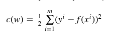
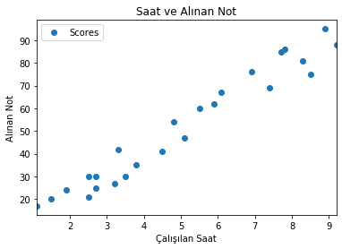

## Linear Regression

Lineer regresyon bir veya birden fazla (bağımsız) değişken ile başka bir (bağımlı) değişken arasındaki bağlantıyı modellemek için kullanılan bir yöntemdir. 

Herhangi bir lineer fonksiyonu şu şekilde ifade edebiliriz:

**f(x)=y=w0+w1x1+w2x2**

Lineer regresyon ile amacımız verilmiş olan x’leri ve y’leri kullanarak w değerlerini bulmak. w değerlerini bulduktan sonra artık y değeri bilinmeyen ama x değerleri verilmiş olan bir veri ile y değeri hesaplanabilecek.

## Maliyet Fonksiyonu

Lineer regresyonda w değer­lerini öyle bir şek­ilde bulun­malı ki tah­min edilen y değeri ile gerçek y değeri arasın­daki hata min­i­mum olsun. Bu durumda asıl amacımız gerçek y değer­leri ile tah­min edilen y değer­leri arasın­daki farkı göstere­cek olan maliyet fonksiy­onunu (cost func­tion) min­i­mize etmek. Maliyet fonksiy­onu şu şek­ilde gösterilmektedir:



Buradaki nota­sy­on­lar şun­ları ifade etmektedir:

* x^i: verisetinde i numar­alı satırın özel­lik­leri.
* f(x^i): tah­min edilen y değeri
* y^i: asıl y değeri

Tah­min edilen y ile asıl y değerini çıkardığımızda asılında farkı elde etmiş oluy­oruz fakat negatif değer­leri ortadan kaldır­mak için karesini alıy­oruz. En sonunda hesa­planan maliyetin 1/2 ile çarpıl­ması ise gelenek­sel bir durum.

## Python ile Linear Regression

### Adım 1


```python
# import library
import pandas as pd
import matplotlib.pyplot as plt
import numpy as np
```

### Adım 2


```python
# import data
df = pd.read_csv("student_scores.csv")
```


```python
df.head()
```


<div>
<style scoped>
    .dataframe tbody tr th:only-of-type {
        vertical-align: middle;
    }

    .dataframe tbody tr th {
        vertical-align: top;
    }

    .dataframe thead th {
        text-align: right;
    }
</style>
<table border="1" class="dataframe">
  <thead>
    <tr style="text-align: right;">
      <th></th>
      <th>Hours</th>
      <th>Scores</th>
    </tr>
  </thead>
  <tbody>
    <tr>
      <td>0</td>
      <td>2.5</td>
      <td>21</td>
    </tr>
    <tr>
      <td>1</td>
      <td>5.1</td>
      <td>47</td>
    </tr>
    <tr>
      <td>2</td>
      <td>3.2</td>
      <td>27</td>
    </tr>
    <tr>
      <td>3</td>
      <td>8.5</td>
      <td>75</td>
    </tr>
    <tr>
      <td>4</td>
      <td>3.5</td>
      <td>30</td>
    </tr>
  </tbody>
</table>
</div>


Görselleştirme yapıyoruz:


```python
df.plot(x='Hours', y='Scores', style='o')
plt.title('Saat ve Alınan Not')
plt.xlabel('Çalışılan Saat')
plt.ylabel('Alınan Not')
plt.show()
```





### Adım 3


```python
X = df.iloc[:, :-1].values
y = df.iloc[:, 1].values
```

### Adım 4

Verimizi train ve test olmak üzere ikiye ayırıyoruz. Burada %20 test verisi mevcut olarak ve %80'de eğitim verisi olacak. Random_state değerini 42 verdiğimiz zaman test ve eğitim verisi olarak böleceği zaman her daim aynı şekilde böler.


```python
from sklearn.model_selection import train_test_split
X_train, X_test, y_train, y_test = train_test_split(X, y, test_size=0.2, random_state=42)
```

### Adım 5

Lineer regresyon algoritmamızı ekliyoruz.


```python
from sklearn.linear_model import LinearRegression
regressor = LinearRegression()
regressor.fit(X_train, y_train)
```


    LinearRegression(copy_X=True, fit_intercept=True, n_jobs=None, normalize=False)


```python
print(regressor.intercept_)
```

    2.018160041434683


```python
print(regressor.coef_)
```

    [9.91065648]


### Adım 6


```python
y_pred = regressor.predict(X_test)
```


```python
result = pd.DataFrame({'Actual': y_test, 'Predicted': y_pred})
result.head()
```


<div>
<style scoped>
    .dataframe tbody tr th:only-of-type {
        vertical-align: middle;
    }

    .dataframe tbody tr th {
        vertical-align: top;
    }

    .dataframe thead th {
        text-align: right;
    }
</style>
<table border="1" class="dataframe">
  <thead>
    <tr style="text-align: right;">
      <th></th>
      <th>Actual</th>
      <th>Predicted</th>
    </tr>
  </thead>
  <tbody>
    <tr>
      <td>0</td>
      <td>20</td>
      <td>16.884145</td>
    </tr>
    <tr>
      <td>1</td>
      <td>27</td>
      <td>33.732261</td>
    </tr>
    <tr>
      <td>2</td>
      <td>69</td>
      <td>75.357018</td>
    </tr>
    <tr>
      <td>3</td>
      <td>30</td>
      <td>26.794801</td>
    </tr>
    <tr>
      <td>4</td>
      <td>62</td>
      <td>60.491033</td>
    </tr>
  </tbody>
</table>
</div>


### Adım 7


```python
from sklearn import metrics
print('Mean Absolute Error:', metrics.mean_absolute_error(y_test, y_pred))
print('Mean Squared Error:', metrics.mean_squared_error(y_test, y_pred))
print('Root Mean Squared Error:', np.sqrt(metrics.mean_squared_error(y_test, y_pred)))
```

    Mean Absolute Error: 4.183859899002975
    Mean Squared Error: 21.5987693072174
    Root Mean Squared Error: 4.6474476121003665


> Son Güncelleme: 2 Aralık 2020 - Perşembe
